# BASH MANILA — Responsive Product Landing Page

A responsive fashion and lifestyle landing page inspired by **BASH MANILA**, created as part of the **Week 5 Laboratory Activity for ITST 302 – Client-Server Technologies**.

The project was developed using **Laravel, Blade Components, Tailwind CSS, Vite, and Vanilla JavaScript**. The landing page presents BASH MANILA's bags, collections, product features, membership plans, testimonials, and promotional content through a modern and responsive interface.

---

## 1. Project Title

**BASH MANILA — Responsive Product Landing Page**

> *The city, carried.*

---

## 2. Introduction

### What is a Product Landing Page?

A product landing page is a webpage designed to introduce a product, service, or brand to visitors. It focuses on presenting important information in an organized and visually appealing way while encouraging visitors to interact with the brand.

For a fashion brand, a landing page can showcase products, collections, brand identity, promotions, customer experiences, and calls to action in one centralized interface.

### Why Landing Pages Are Important

Landing pages are important for businesses because they provide visitors with a strong first impression of a brand.

A well-designed landing page can:

- Showcase products and services
- Establish a strong brand identity
- Present important information clearly
- Improve user engagement
- Provide simple navigation
- Encourage customers to take action
- Create a professional online presence

### Purpose of the Project

The purpose of this project was to create a modern and responsive landing page inspired by **BASH MANILA**, a fashion and lifestyle brand.

The design focuses on bags and accessories intended for everyday city life. The interface combines product imagery, product features, collections, membership plans, testimonials, and promotional content into one cohesive landing page.

The project also allowed me to apply Laravel Blade Components and Tailwind CSS to create a modular and responsive frontend.

---

## 3. Objectives

Through this activity, I was able to:

- Develop a responsive landing page using Tailwind CSS.
- Use Laravel Blade Components to create reusable UI elements.
- Apply Flexbox and CSS Grid for responsive layouts.
- Create a mobile-friendly navigation system.
- Apply consistent colors, typography, spacing, and visual hierarchy.
- Implement interactive frontend behavior using Vanilla JavaScript.
- Organize the project using Laravel's recommended folder structure.
- Practice Git and GitHub project management.
- Improve my understanding of modern UI/UX design.
- Create a portfolio-ready frontend project.

---

# 4. Responsive Web Design

Responsive Web Design allows a website to adapt to different screen sizes and devices.

The BASH MANILA landing page was designed and tested for:

- Desktop
- Laptop
- Tablet
- Mobile Phone

### Mobile-First Design

The layout was created to remain usable on smaller screens while progressively expanding for larger devices.

For example, the navigation changes from a full desktop navigation bar into a collapsible mobile menu.

The product and collection sections also change their number of columns depending on the screen size.

### Responsive Breakpoints

Tailwind CSS responsive classes were used throughout the project.

For example:

```html
<div class="grid grid-cols-1 sm:grid-cols-2 lg:grid-cols-3">
````

This allows the layout to display:

* One column on small screens
* Two columns on medium-sized screens
* Three columns on large screens

### Flexbox

Flexbox was used for navigation, buttons, product layouts, and content alignment.

Example:

```html
<div class="flex items-center justify-between">
```

Flexbox makes it easier to align and distribute elements while allowing the layout to respond to different screen sizes.

### CSS Grid

CSS Grid was used extensively for sections containing multiple cards.

The features section, collections, pricing cards, and testimonials use responsive grid layouts.

### User Experience

Responsive design improves the overall user experience because visitors can browse the BASH MANILA landing page regardless of the device they use.

The design also includes:

* Smooth scrolling
* Hover effects
* Animated content reveals
* Responsive navigation
* Swipeable content on mobile
* Reduced-motion support

These features help make the interface more interactive while keeping it accessible and usable.

---

# 5. Tailwind CSS

Tailwind CSS is a utility-first CSS framework that allows developers to style elements directly through predefined utility classes.

This project uses **Tailwind CSS 4** together with the Tailwind Vite plugin.

### Utility-First CSS

Instead of creating a separate CSS rule for every element, Tailwind utility classes are used directly in the Blade templates.

For example:

```html
<button class="rounded-full px-6 py-3 text-sm font-semibold">
    Shop Now
</button>
```

The classes control the button's:

* Border radius
* Padding
* Font size
* Font weight

### Advantages of Tailwind CSS

Tailwind CSS helped make the development process more efficient because styles could be applied directly where they were needed.

Advantages include:

* Faster UI development
* Responsive utility classes
* Consistent spacing
* Easy hover effects
* Easy responsive layouts
* Reusable styling patterns
* Less repetitive CSS

### Custom Theme

The project defines its own BASH MANILA color palette in `resources/css/app.css`.

```css
@theme {
    --color-blush: #FBF0EA;
    --color-bash-pink: #F0567A;
    --color-bash-pink-soft: #F6A8BE;
    --color-bash-ink: #191410;
    --color-bash-chrome: #B8BCC2;
    --color-bash-coral: #FF5A36;
}
```

This allows custom utilities such as:

```text
bg-bash-pink
text-bash-ink
bg-blush
text-bash-pink
```

to be used throughout the project.

### Typography

Two fonts are used in the project:

* **Bricolage Grotesque** — display/headings
* **Manrope** — body text

They are defined in the Tailwind theme:

```css
--font-display: 'Bricolage Grotesque', sans-serif;
--font-body: 'Manrope', sans-serif;
```

This creates a clear distinction between headings and body content.

---

# 6. Blade Components

Blade Components are reusable interface elements provided by Laravel's Blade templating system.

Instead of putting the entire landing page into one large Blade file, the project divides the interface into multiple reusable components.

### Components Used

The project contains the following components:

```text
resources/views/components/
├── button.blade.php
├── clasp-card.blade.php
├── collections.blade.php
├── cta.blade.php
├── feature-card.blade.php
├── footer.blade.php
├── hero.blade.php
├── marquee.blade.php
├── navbar.blade.php
├── pricing-card.blade.php
├── product-showcase.blade.php
└── testimonial-card.blade.php
```

### Reusable Button Component

The `button.blade.php` component provides reusable button styles.

It supports different variants such as:

* Primary
* Coral
* Ghost
* Dark
* Outline

Example:

```blade
<x-button href="#pricing" variant="primary">
    Shop the drop
</x-button>
```

This prevents repeated button markup throughout the project.

### Feature Card Component

The `feature-card.blade.php` component is used for the different BASH MANILA product features.

Examples include:

* Vegan Leather Shell
* Hidden Laptop Sleeve
* Reflective Stitching
* Interchangeable Straps
* Lifetime Repair Promise

The component accepts properties such as:

```blade
<x-feature-card
    title="Hidden Laptop Sleeve"
    description="A padded 14-inch sleeve tucked against your back."
/>
```

### Pricing Card Component

The pricing cards are generated using the same reusable component.

The project includes three membership plans:

| Plan    |       Price |
| ------- | ----------: |
| Street  |        Free |
| Insider |   ₱499/year |
| Icon    | ₱1,999/year |

The featured plan can also be highlighted through a component property.

### Testimonial Component

The testimonial component accepts:

* Customer name
* Position
* Review

The component also generates a two-letter monogram from the customer's name instead of requiring a separate customer photo asset.

### Benefits of Component-Based Development

Using Blade Components makes the project:

* More organized
* Easier to maintain
* Less repetitive
* Easier to update
* More consistent
* More scalable

If a component's design needs to change, the component can be updated without manually changing every instance.

---

# 7. User Interface Design

The BASH MANILA interface was designed around a modern fashion and lifestyle aesthetic.

## Color Palette

The main colors used in the project are:

| Color     | Hex       |
| --------- | --------- |
| Blush     | `#FBF0EA` |
| BASH Pink | `#F0567A` |
| Soft Pink | `#F6A8BE` |
| BASH Ink  | `#191410` |
| Chrome    | `#B8BCC2` |
| Coral     | `#FF5A36` |

The combination of blush, pink, dark ink, chrome, and coral creates a visual identity that supports the fashion-oriented theme of the landing page.

## Typography

The project uses:

**Bricolage Grotesque**

Used primarily for:

* Headings
* Product names
* Large display text
* Section titles

**Manrope**

Used primarily for:

* Paragraphs
* Navigation
* Buttons
* Supporting information

The combination creates visual hierarchy while maintaining readability.

## Iconography

Inline SVG icons are used throughout the project for product features and interface elements.

Examples include icons for:

* Product features
* Navigation
* Social media
* Check marks
* Showcase controls

Using SVG icons keeps them scalable and avoids relying on large image files.

## Button Styles

Buttons use a consistent rounded style:

```html
class="rounded-full px-6 py-3"
```

Different variants are provided through the reusable Button component.

Examples include:

* Primary pink buttons
* Outline buttons
* Ghost buttons
* Dark buttons

## Card Design

The landing page uses rounded cards with:

* Large border radius
* Consistent padding
* Shadows
* Hover effects
* Responsive layouts

The cards are used for:

* Features
* Products
* Collections
* Pricing plans
* Testimonials

## Layout Consistency

The landing page maintains consistent:

* Spacing
* Typography
* Border radius
* Colors
* Button styles
* Card styling
* Section widths

This creates a cohesive interface from the navigation bar down to the footer.

---

# 8. Interactive Features

In addition to responsive styling, the project includes several interactive features implemented using **Vanilla JavaScript**.

## Mobile Navigation

The mobile navigation can be opened and closed using the menu button.

The menu uses an animated height and opacity transition rather than simply appearing instantly.

## Scroll Reveal

Elements with the `.reveal` class animate into view when they enter the viewport.

The animation includes:

* Fade
* Blur
* Vertical movement
* Scaling
* Slight rotation

The animation is controlled using `IntersectionObserver`.

## Cursor Spotlight

Cards with the `.spotlight` class track the user's cursor.

A radial gradient follows the pointer across the card, creating a subtle lighting effect.

## 3D Tilt Cards

Some cards use a small 3D tilt effect when the cursor moves over them.

The JavaScript calculates the cursor's position and applies a perspective transformation.

## Magnetic Clasp Demo

The Magnetic Chrome Hardware feature includes an interactive clasp demonstration.

When the card is clicked, the two chrome pieces move toward each other to simulate the magnetic clasp closing.

The component also supports keyboard interaction through:

* Enter
* Space

## Product Showcase

The product showcase works as a swipeable filmstrip.

Users can:

* Swipe through images
* Use previous/next buttons
* Select progress dots

The active progress indicator updates as the user changes slides.

## Expedition Compass

The showcase includes an interactive compass whose needle follows the cursor.

This adds another interactive visual element to the product showcase.

## Reduced Motion

The project also includes a `prefers-reduced-motion` media query.

When users have reduced-motion preferences enabled, animations and motion effects are disabled or reduced.

This helps improve accessibility for users who are sensitive to motion.

---

# 9. Folder Structure

The project follows a Laravel-based structure.

```text
week05-product-landing-page/
│
├── app/
│
├── database/
│
├── public/
│   └── images/
│
├── resources/
│   ├── css/
│   │   └── app.css
│   │
│   ├── js/
│   │   └── app.js
│   │
│   └── views/
│       ├── layouts/
│       │   └── app.blade.php
│       │
│       ├── components/
│       │   ├── button.blade.php
│       │   ├── clasp-card.blade.php
│       │   ├── collections.blade.php
│       │   ├── cta.blade.php
│       │   ├── feature-card.blade.php
│       │   ├── footer.blade.php
│       │   ├── hero.blade.php
│       │   ├── marquee.blade.php
│       │   ├── navbar.blade.php
│       │   ├── pricing-card.blade.php
│       │   ├── product-showcase.blade.php
│       │   └── testimonial-card.blade.php
│       │
│       └── pages/
│           └── home.blade.php
│
├── routes/
│   └── web.php
│
├── screenshots/
│
│
├── composer.json
├── package.json
└── README.md
```

### `resources/views/layouts`

Contains the main Blade layout used by the application.

`app.blade.php` provides the overall HTML structure, navigation, page content area, and footer.

### `resources/views/components`

Contains the reusable Blade Components used throughout the landing page.

### `resources/views/pages`

Contains the page-specific Blade views.

The main landing page is:

```text
resources/views/pages/home.blade.php
```

### `resources/css`

Contains the project's Tailwind CSS configuration, custom theme variables, animations, responsive styling, and additional CSS.

### `resources/js`

Contains Vanilla JavaScript used for the site's interactive features.

### `public`

Contains publicly accessible assets including product images, campaign images, logos, and icons.

### `screenshots`

Contains screenshots documenting the completed project.

### `documentation`

Used for project documentation such as the before-and-after comparison.

---

# 10. Landing Page Sections

The final landing page contains several major sections.

## Navigation Bar

The navigation includes:

* BASH MANILA logo
* Home
* Features
* Pricing
* Testimonials
* Contact
* Sign In
* Get Started

A responsive mobile menu is also implemented.

## Hero Section

The hero section introduces BASH MANILA with the headline:

> **the city, carried.**

It also includes:

* Season 04 branding
* Product description
* Shop the Drop button
* See What's Inside button
* Hero product image
* Floating chrome elements
* Season 04 information card

## Features Section

The features section highlights six product characteristics:

1. Vegan Leather Shell
2. Magnetic Chrome Hardware
3. Hidden Laptop Sleeve
4. Reflective Stitching
5. Interchangeable Straps
6. Lifetime Repair Promise

The Magnetic Chrome Hardware card includes an interactive clasp demonstration.

## Product Showcase

The product showcase presents BASH MANILA campaign imagery and introduces app-related product functionality.

It highlights:

* Live drop countdowns
* Product authentication
* QR-based bag history
* One-tap repairs
* Order tracking

## Collections

The collections section presents individual products such as:

* The Weekday Tote — ₱1,890
* The Carry-On — ₱4,250
* The Daily Backpack — ₱2,450

It also includes curated sets:

* The Organizer Set
* The Expedition Set

## BASH Club Pricing

The membership section contains three plans:

### Street

Free membership with:

* Newsletter early access
* Member pricing on totes
* Birthday surprise

### Insider

₱499/year with:

* Everything in Street
* Free shipping
* 48-hour early drop access
* Priority customer care

### Icon

₱1,999/year with:

* Everything in Insider
* One free repair per year
* Invitations to Manila pop-ups
* Personalized embossing

## Testimonials

The testimonial section contains three customer reviews from:

* Ella Ramos
* Miguel Santos
* Dani Cruz

Each testimonial displays the customer's name, position, initials, and review.

## Call-to-Action

The CTA encourages visitors to join BASH Club and receive early access to upcoming drops.

It includes an email input and a **Get Started** button.

## Footer

The footer contains:

* BASH MANILA description
* Social media icons
* Quick links
* Contact information
* Copyright information

---

# 11. Screenshots

The project includes screenshots documenting the final interface and its different sections.

## Desktop View

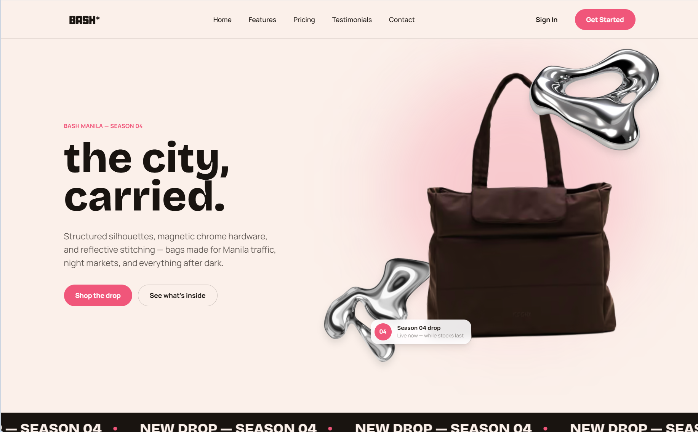

## Tablet View

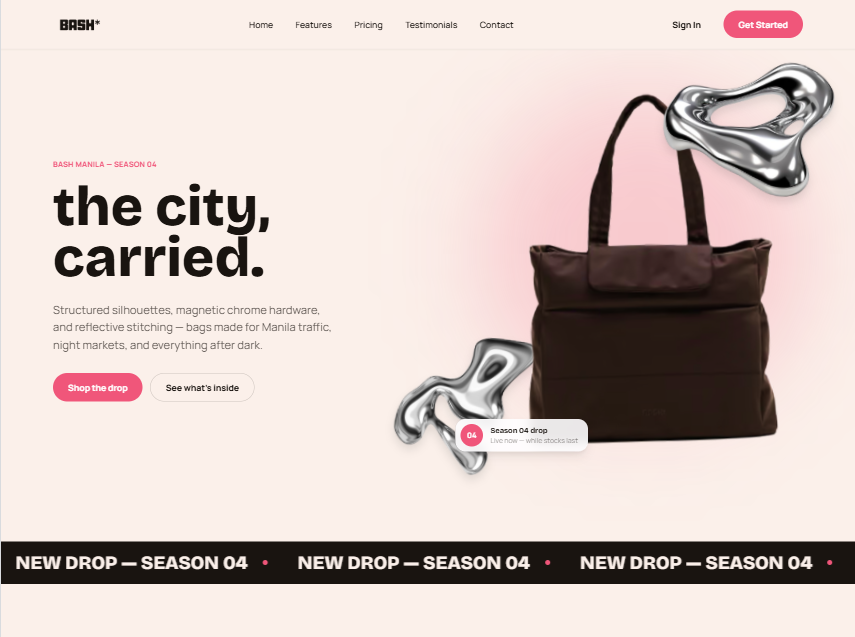

## Mobile View

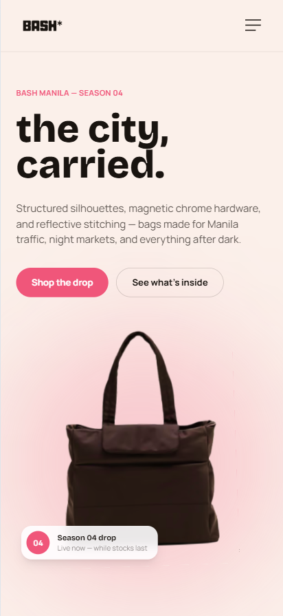

## Navigation Bar

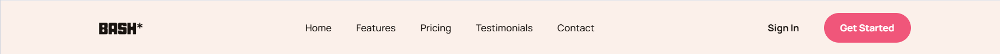

## Hero Section

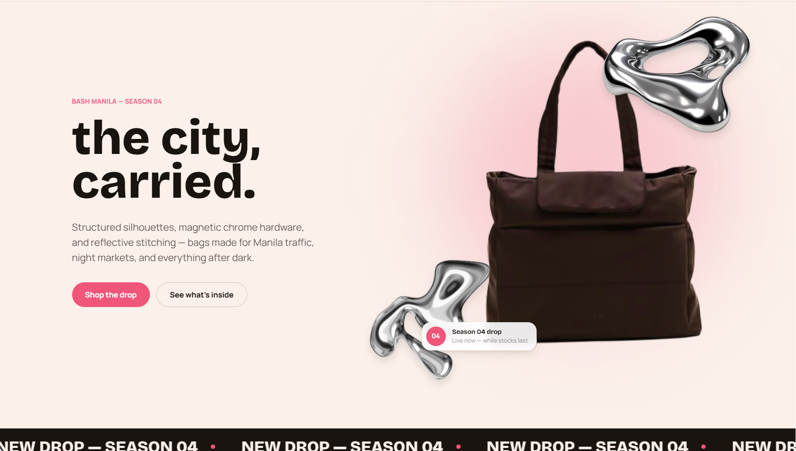

## Features Section

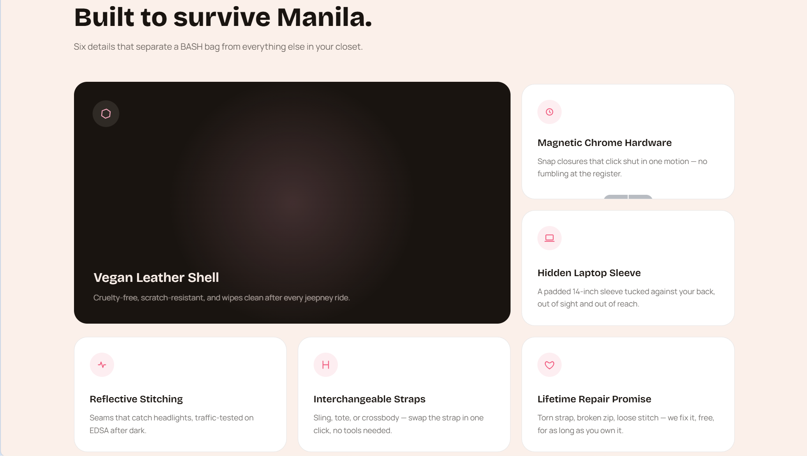

## Pricing Section

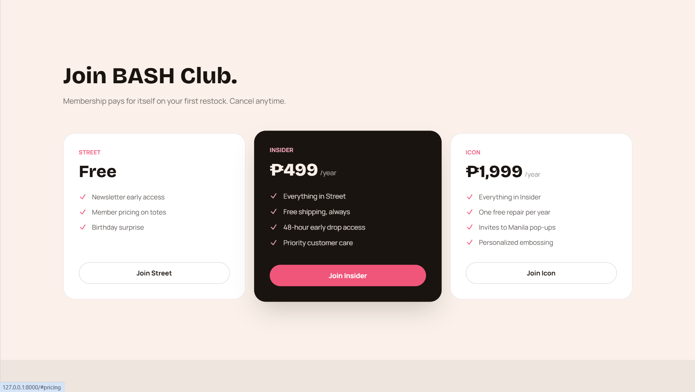

## Testimonials

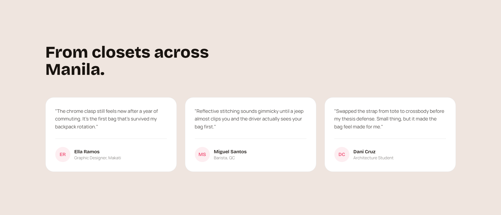

## Footer

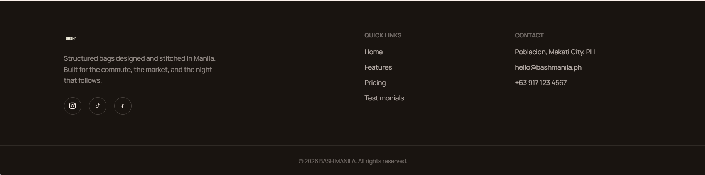

## Blade Components Folder

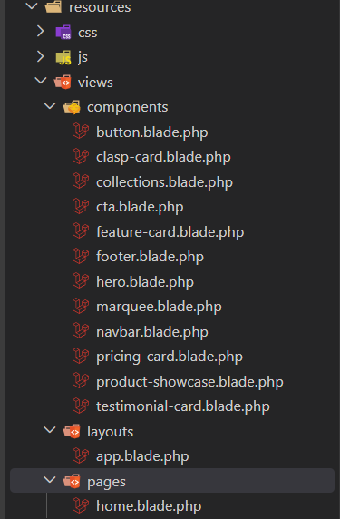

## VS Code Project Structure

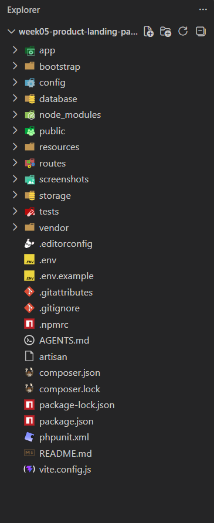

---

# 12. Before-and-After Comparison

## Before

The initial design focused on establishing the basic structure and content of the landing page. The interface required further styling, component organization, and responsive improvements.

The early version served as the starting point for developing the final visual design.

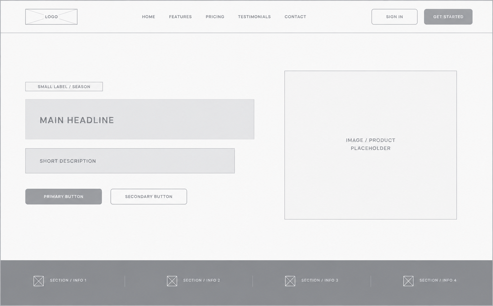


## After

The final version has a more polished interface with:

* Improved visual hierarchy
* Consistent typography
* Custom BASH MANILA color palette
* Responsive layouts
* Reusable Blade Components
* Interactive JavaScript features
* Improved spacing
* Rounded card designs
* Hover effects
* Scroll animations
* Mobile navigation

The final result provides a more complete and professional user experience across desktop, tablet, and mobile devices.

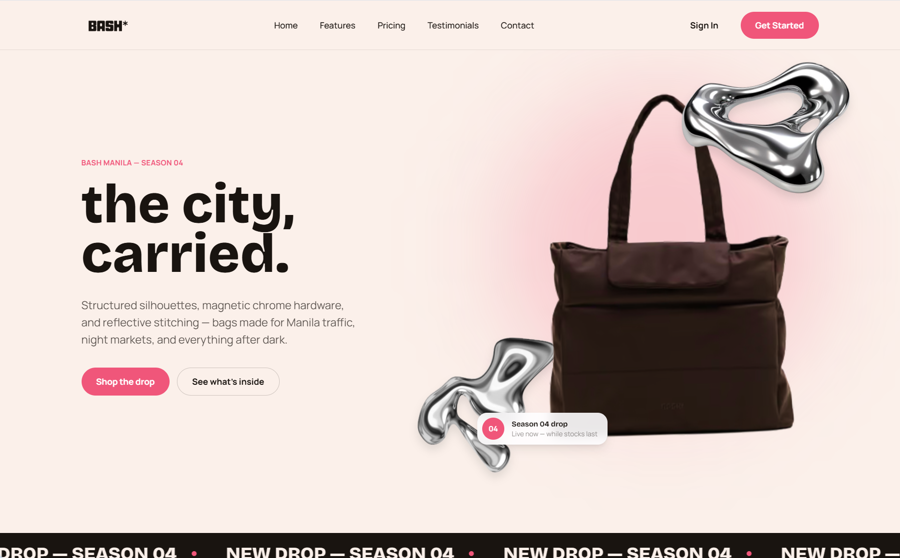


---

# 13. Challenges and Solutions

## Challenge 1 — Responsive Layout

One of the challenges was making the different sections work across desktop, tablet, and mobile screen sizes.

### Solution

Tailwind CSS responsive utilities, Flexbox, and CSS Grid were used to dynamically change layouts based on screen size.

---

## Challenge 2 — Repeated UI Elements

Several sections contain similar cards, such as feature cards, pricing cards, and testimonials.

### Solution

Reusable Blade Components were created to avoid repeating the same HTML structure.

For example:

```blade
<x-pricing-card
    plan="Insider"
    price="₱499"
    period="year"
/>
```

This makes the code easier to maintain and keeps the design consistent.

---

## Challenge 3 — Creating Interactive Effects

The landing page needed more than static content to create an engaging experience.

### Solution

Vanilla JavaScript was used to implement:

* Mobile navigation
* Scroll reveal
* Cursor spotlight
* Card tilt
* Magnetic clasp interaction
* Product showcase navigation
* Interactive compass

This allowed the project to remain lightweight without requiring a JavaScript framework.

---

## Challenge 4 — Maintaining a Consistent Visual Identity

Creating different sections while maintaining the same visual language was another challenge.

### Solution

A custom Tailwind theme was created with shared:

* Colors
* Fonts
* Animations
* Spacing
* Border styles

This helped maintain consistency throughout the entire page.

---

# 14. Technologies Used

| Technology         | Purpose                                        |
| ------------------ | ---------------------------------------------- |
| Laravel 13         | Backend framework and application structure    |
| Blade              | Server-side templating and reusable components |
| Tailwind CSS 4     | Utility-first styling                          |
| Vite               | Frontend asset development and bundling        |
| Vanilla JavaScript | Interactive frontend functionality             |
| HTML               | Page structure                                 |
| CSS                | Custom styling and animations                  |
| Git                | Version control                                |
| GitHub             | Repository hosting                             |

---

# 15. Project Setup

### Requirements

Make sure the following are installed:

* PHP 8.3 or higher
* Composer
* Node.js
* NPM

### Installation

Clone the repository:

```bash
git clone <your-github-repository-url>
```

Navigate to the project:

```bash
cd week05-product-landing-page
```

Install PHP dependencies:

```bash
composer install
```

Install frontend dependencies:

```bash
npm install
```

Create the environment file:

```bash
cp .env.example .env
```

Generate the Laravel application key:

```bash
php artisan key:generate
```

Run the development server:

```bash
php artisan serve
```

In another terminal, run Vite:

```bash
npm run dev
```

The application can then be accessed through the Laravel development server.

---

# 16. GitHub Repository

This project was managed using Git and GitHub.

**Repository:**
`[Insert your GitHub Repository Link here]`

The repository contains:

* Laravel source code
* Blade Components
* Tailwind CSS
* JavaScript interactions
* Product assets
* Screenshots
* Documentation

---

# 17. Reflection

Creating the BASH MANILA landing page helped me understand how Laravel, Blade Components, Tailwind CSS, and JavaScript can work together to create a modern web interface.

One of the most important things I learned from this activity was the value of reusable components. Instead of repeatedly writing the same HTML structure, Blade Components allowed me to create UI elements that could be reused throughout the page.

I also learned how responsive design, animations, typography, spacing, and color choices affect the overall user experience. Implementing interactive features using Vanilla JavaScript also helped me understand how a static landing page can be made more engaging without relying on a JavaScript framework.

Overall, this project improved my skills in frontend development, responsive design, Laravel Blade, Tailwind CSS, and UI/UX design.

---

# 18. Conclusion

The BASH MANILA Responsive Product Landing Page demonstrates the use of Laravel, Blade Components, Tailwind CSS, Vite, and Vanilla JavaScript to create a modern and responsive fashion-oriented landing page.

The project combines reusable components, responsive layouts, custom styling, product showcases, membership plans, testimonials, animations, and interactive elements into one cohesive interface.

Through this activity, I was able to apply modern frontend development techniques while building a project that can also serve as part of my web development portfolio.

---


```
